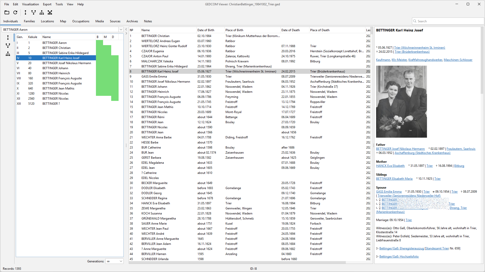
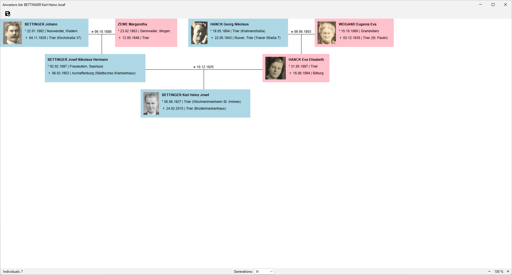
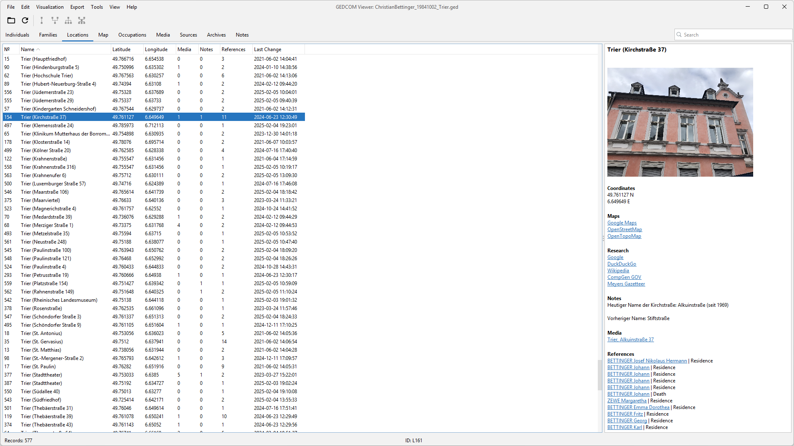
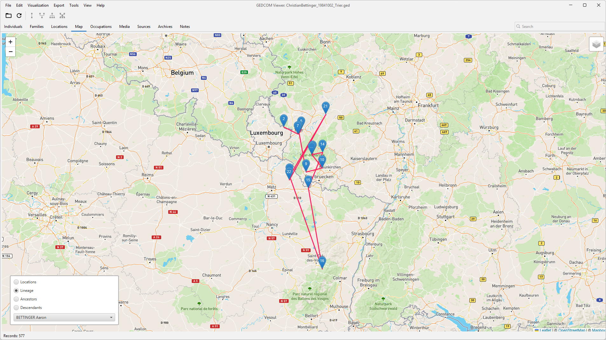

# GEDCOM Viewer

The aim of this project is to realize a cross-platform and multi-language viewer for GEDCOM 5 files in Java, whose GUI is closely based on the GEDCOM specification and yet is easy to use.

## Features
* Display of all GEDCOM record types
* Visualization of and fast navigation through a proband's lineage (name or male line), ancestors or/and descendants
* Display of event locations within a map
* Quick overview of the source qualities
* Export to HTML or PDF (including media attachments)
* Conversion to GEDCOM 7 file format
* Currently supported languages: English, German, French

## Screenshots

## Deployment
Currently the project is deployed via source code. 

The project is built using OpenJDK 23 and Maven.
