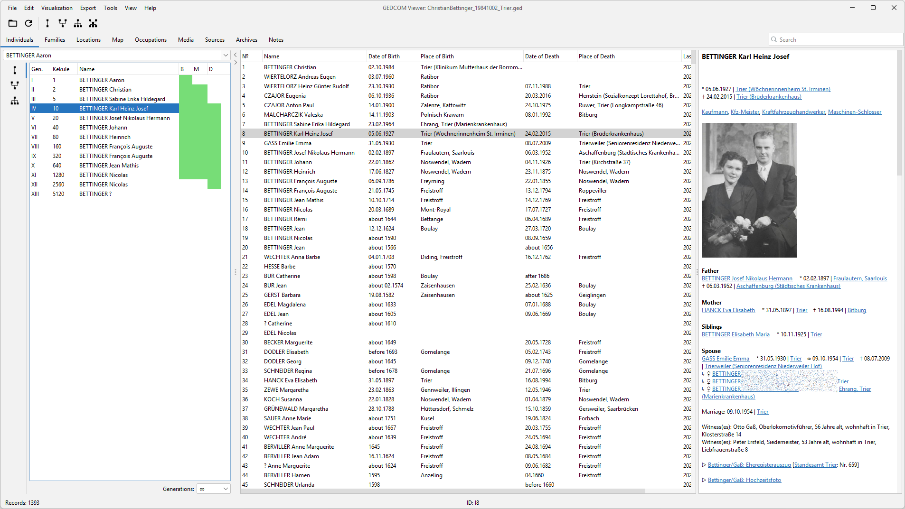
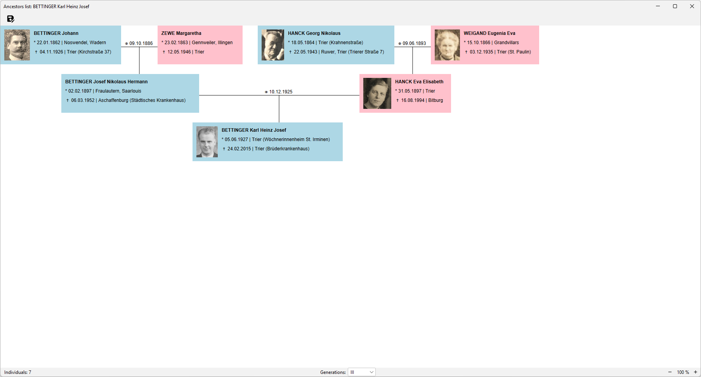
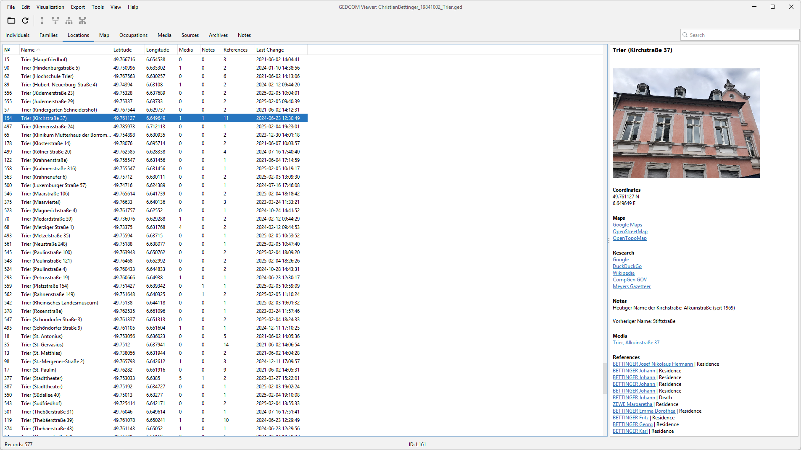
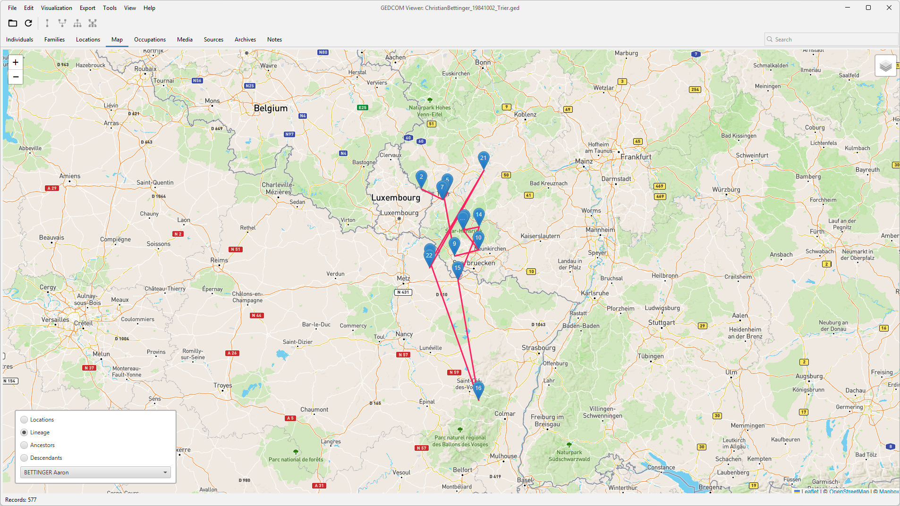
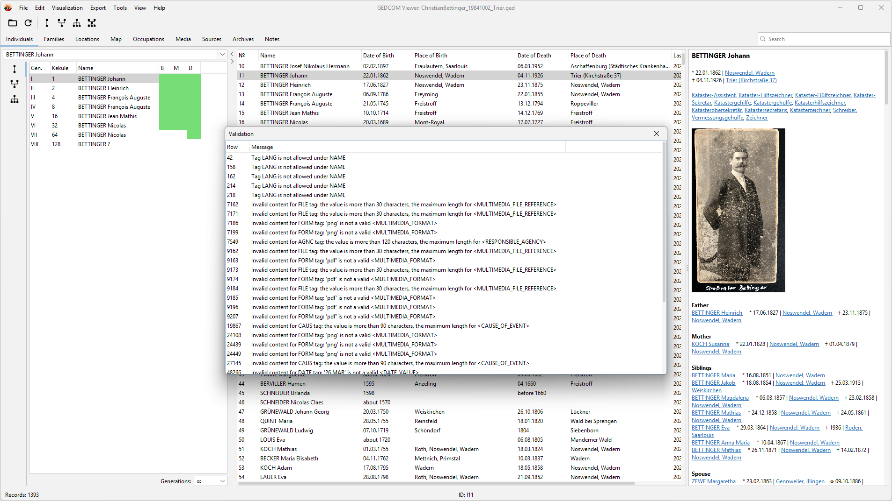

# GEDCOM Viewer

The aim of this project is to realize a cross-platform and multi-language viewer for GEDCOM 5 files in Java, whose GUI is closely based on the GEDCOM specification and yet is easy to use.

## Features

* Display of all GEDCOM record types
* Visualization of and fast navigation through a proband's lineage (name or male line), ancestors or/and descendants
* Display of main fact locations within a map
* Quick overview of the source qualities
* Export to HTML or PDF (including media attachments)
* GEDCOM 5 validation
* Conversion to GEDCOM 7 file format
* Currently supported languages: English, German, French

## Screenshots

## Requirements

* Java 22+

## Changelog

### 1.1.2

* Fixed bug that caused rendering of portraits within visualizations to fail 

### 1.1.1

* Handle GEDKeeper-specific media file paths starting with "rel:"
* Ignore extension tags without value

### 1.1.0

* Added matrilineal lineage
* Temporarily removed tool *Facial feature analysis* due to ongoing development
