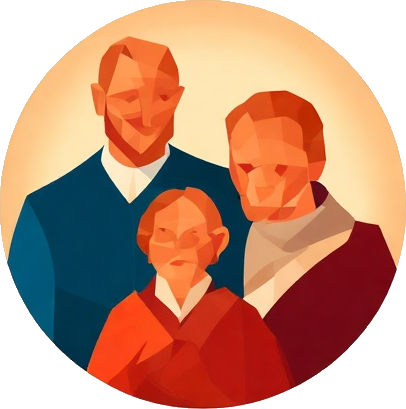
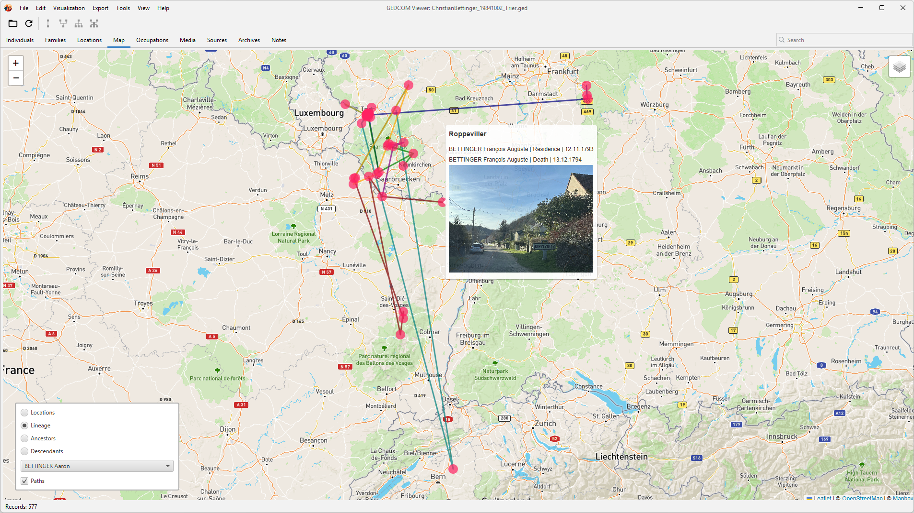
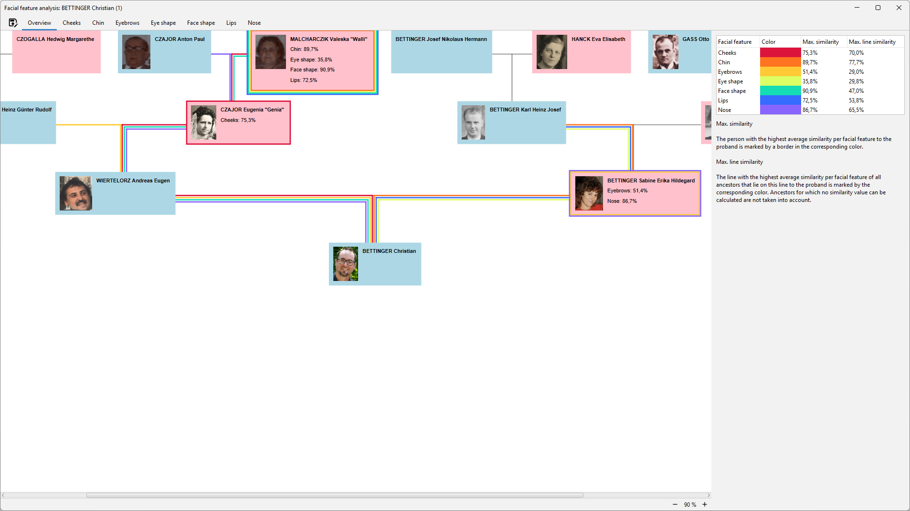

# GEDCOM Viewer

The aim of this project is to realize a cross-platform and multi-language viewer for GEDCOM 5.5.1 files in Java, whose GUI is closely based on the GEDCOM specification and yet is easy to use.

## Features

* Display of all GEDCOM record types
* Visualization of and fast navigation through a proband's lineage (name or male line), ancestors or/and descendants
* Display of main fact locations within a map
* Quick overview of the source qualities
* Export to HTML or PDF (including media attachments)
* Conversion to GEDCOM 7 file format
* Facial feature analysis to find out from which ancestors a proband inherited his facial features (such as the shape of the eyes or nose)
* Currently supported languages: English, German, French

## Screenshots

## Requirements

* Java 16+
* Python 3.12 (only for facial feature analysis)
